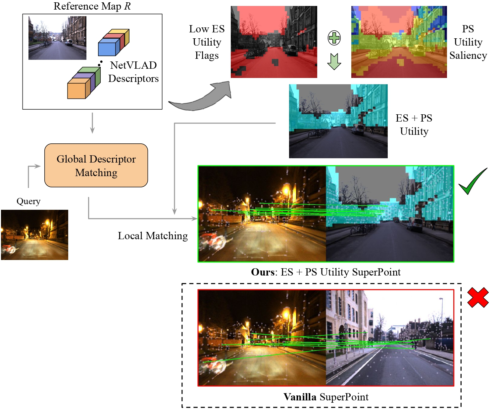

# A Hierarchical Dual Model of Environment- and Place-Specific Utility for Visual Place Recognition

[](https://creativecommons.org/licenses/by-nc-sa/4.0/)
[](https://github.com/Nik-V9/HEAPUtil/stargazers)
[](https://qcr.github.io/collection/vpr_overview/)
[](https://arxiv.org/abs/2107.02440)
[](https://ieeexplore.ieee.org/abstract/document/9484750)
[](https://colab.research.google.com/github/Nik-V9/HEAPUtil/blob/main/HEAPUtil_Demo.ipynb)

[](https://paperswithcode.com/sota/visual-place-recognition-on-berlin-kudamm?p=a-hierarchical-dual-model-of-environment-and)

## Introduction

HEAPUtil is an IEEE RA-L & IROS 2021 research paper. In this work, we present a method for unsupervised estimation of the Environment-Specific (ES) and Place-Specific (PS) Utility of unique visual cues in a reference map represented as VLAD clusters. Furthermore, we employ this Utility in a unified hierarchical global-to-local VPR pipeline to enable better place recognition and localization capability for robots, with reduced storage and compute time requirements. This repo contains the official code for estimating the Utility of visual cues and the hierarchical global-to-local VPR pipeline.

<p align="center">
  
    <br/><em>Utility-guided Hierarchical Visual Place Recognition.</em>
</p>

For more details, please see:

* Full paper PDF: [A Hierarchical Dual Model of Environment- and Place-Specific Utility for Visual Place Recognition](https://arxiv.org/abs/2107.02440).

* Authors: *Nikhil Varma Keetha, Michael Milford, Sourav Garg*

## Dependencies

Simply run the following command: `pip install -r requirements.txt`

### Conda

```bash
conda create -n heaputil python=3.8 mamba -c conda-forge -y
conda activate heaputil
mamba install numpy opencv pytorch matplotlib faiss-gpu scipy scikit-image=0.18.2 torchvision scikit-learn h5py -c conda-forge
```

## Data

For Data Loading, we use `.mat` files which contain information regarding `Reference Image Paths`, `Query Image Paths`, `Ground-truth Co-ordinates` for Reference and Query Images, and the `Positive Localization Distance Threshold`. These `.mat` files for the Berlin Kudamm, Nordland Summer Vs Winter and Oxford Day Vs Night datasets are present in the `./dataset-mat-files` folder.

We provide the Berlin Kudamm Dataset for Inference:

* [Google Drive](https://drive.google.com/drive/folders/1s-pbcipbNoqQUjb5587lEung52NsP-C0?usp=sharing)

For more details regarding the Berlin Kudamm dataset please refer to [this paper](https://arxiv.org/abs/2002.03895).

For all the scripts, apart from SuperPoint Extraction, you may use the `--dataset` flag to mention the dataset to use. By default, it is set to `'berlin'` and the default choices are `['oxford', 'nordland', 'berlin']`.

## Quick Start

Here's a [Colab Notebook](https://colab.research.google.com/github/Nik-V9/HEAPUtil/blob/main/HEAPUtil_Demo.ipynb) to effortlessly run tests on the Berlin Dataset.

## Scripts

Please use the `--help` flag to see all available arguments for the scripts.

### NetVLAD (Global Descriptor) 

Extract NetVLAD Descriptors, Predictions and Cluster Masks:

```sh
python NetVLAD/main.py --resume './data/NetVLAD/netvlad-checkpoint-cc16' --root_dir './data' --save --save_path './data/NetVLAD'
```

### Environment- and Place-Specific Utility Estimation

Estimate the Environment- and Place-Specific Utility of VLAD Clusters for the Reference Map:

```sh
python utility.py --root_dir './data' --netvlad_extracts_path './data/NetVLAD' --save_path './data/Utility' --save_viz
```

You may use the `--save_viz` flag to visualize the Environment-Specific and Place-Specific Utility as shown below:

<p align="center">
    &nbsp; &nbsp; 
    <br/><em> Visualizing ES (left) & PS (right) Utility (Red indicates low utility and blue/gray indicates high utility)</em>
</p>

### SuperPoint Feature Extraction

Generate path lists which are required for SuperPoint Extraction & SuperGlue:

```sh
python generate_path_lists.py --root_dir './data' --netvlad_predictions './data/NetVLAD' --save_path './data'
```

Extract SuperPoint features for the Reference Map:

```sh
python SuperGlue/superpoint_extraction.py --input_images './data/db_list.txt' --split 'db' --input_dir './data' --output_dir './data/SuperPoint'
```

Extract SuperPoint features for the Queries:

```sh
python SuperGlue/superpoint_extraction.py --input_images './data/q_list.txt' --split 'query' --input_dir './data' --output_dir './data/SuperPoint'
```

### Utility-guided Local Feature Matching

You may use the `--viz` flag to visualize the best matches as a gif.

#### Vanilla

Run Vanilla SuperPoint based Local Feature Matching:

```sh
python local_feature_matching.py --input_dir './data' --output_dir './data/LFM/Vanilla' \
--netvlad_extracts_path './data/NetVLAD' --superpoint_extracts_path './data/SuperPoint' --utility_path './data/Utility'
```

#### Environment-Specific (ES) Utility

Run ES-Utility guided Local Feature Matching:

```sh
python local_feature_matching.py --input_dir './data' --output_dir './data/LFM/ES_Utility' \
--netvlad_extracts_path './data/NetVLAD' --superpoint_extracts_path './data/SuperPoint' --utility_path './data/Utility' \
--es_utility
```

#### Place-Specific (PS) Utility

Run PS-Utility guided Local Feature Matching:

```sh
python local_feature_matching.py --input_dir './data' --output_dir './data/LFM/PS_Utility' \
--netvlad_extracts_path './data/NetVLAD' --superpoint_extracts_path './data/SuperPoint' --utility_path './data/Utility' \
--ps_utility
```

Default Number of Top Utility Clusters to use for Local Feature Matching is `10`. Please use the `--k` flag to use a different number of top utility clusters.

#### Combined ES & PS Utility

Run ES & PS-Utility guided Local Feature Matching:

```sh
python local_feature_matching.py --input_dir './data' --output_dir './data/LFM/Utility' \
--netvlad_extracts_path './data/NetVLAD' --superpoint_extracts_path './data/SuperPoint' --utility_path './data/Utility' \
--es_utility --ps_utility --viz
```

Default Number of Top Utility Clusters to use for Local Feature Matching is `X-1` clusters, where `X` is the number of useful clusters determined by the Environment-Specific system. To use a different number of top utility clusters please use the `--non_default_k` and `--k` flags.

We use the `--viz` flag to visualize the best matches along with utility reference masks as a gif as shown below:

<p align="center">
  
    <br/><em>ES & PS Utility-guided Local Feature Matching (Cyan mask represents regions with high utility)</em>
</p>

### Utility-guided SuperGlue

Similar to Local Feature Matching, you may run the `superglue_match_pairs.py` file for Vanilla SuperGlue & Utility-guided SuperGlue. You may use the `--viz` flag to visualize all the matches and dump the SuperGlue-style plots.

Run ES & PS-Utility guided SuperGlue:

```sh
python superglue_match_pairs.py --input_pairs './data/berlin_netvlad_candidate_list.txt' --input_dir './data' --output_dir './data/SuperGlue/Utility' \
--netvlad_extracts_path './data/NetVLAD' --utility_path './data/Utility' \
--es_utility --ps_utility
```

## BibTeX Citation

If any ideas from the paper or code from this repo are used, please consider citing:

```txt
@article{keetha2021hierarchical,
  author={Keetha, Nikhil Varma and Milford, Michael and Garg, Sourav},
  journal={IEEE Robotics and Automation Letters}, 
  title={A Hierarchical Dual Model of Environment- and Place-Specific Utility for Visual Place Recognition}, 
  year={2021},
  volume={6},
  number={4},
  pages={6969-6976},
  doi={10.1109/LRA.2021.3096751}}
```

The code is licensed under the [MIT License](./LICENSE).

## Acknowledgements

The authors acknowledge the support from the Queensland University of Technology (QUT) through the Centre for Robotics.

Furthermore, we would like to acknowledge the [Pytorch Implementation of NetVlad](https://github.com/Nanne/pytorch-NetVlad) from Nanne and the original implementation of [SuperGlue](https://github.com/magicleap/SuperGluePretrainedNetwork).

## Related works

Please check out [this collection](https://qcr.github.io/collection/vpr_overview/) of related works on place recognition.
